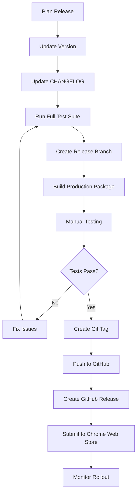

# Deployment Guide

This guide covers the release process for Parchment-Assist, including versioning, building, testing, and publishing to the Chrome Web Store.

## Table of Contents

- [Prerequisites](#prerequisites)
- [Release Process Overview](#release-process-overview)
- [Versioning](#versioning)
- [Pre-Release Checklist](#pre-release-checklist)
- [Building for Production](#building-for-production)
- [Chrome Web Store Submission](#chrome-web-store-submission)
- [Post-Release Tasks](#post-release-tasks)
- [Automated Releases](#automated-releases)
- [Rollback Procedure](#rollback-procedure)

---

## Prerequisites

Before deploying a release, ensure you have:

- [ ] **Maintainer Access**: Push access to the GitHub repository
- [ ] **Chrome Web Store Account**: Developer account with Parchment-Assist listed
- [ ] **Node.js >=18.0.0**: For building and testing
- [ ] **Git**: For tagging and version management
- [ ] **Chrome Browser**: For final testing

---

## Release Process Overview



---

## Versioning

We follow [Semantic Versioning](https://semver.org/) (SemVer):

```
MAJOR.MINOR.PATCH

Example: 1.2.3
```

### Version Increment Rules

- **MAJOR**: Breaking changes, major rewrites
  - Example: `1.0.0` → `2.0.0`
  - Chrome manifest changes that break compatibility
  - Removal of features

- **MINOR**: New features, non-breaking changes
  - Example: `1.0.0` → `1.1.0`
  - New AI providers
  - New UI features
  - New configuration options

- **PATCH**: Bug fixes, minor improvements
  - Example: `1.0.0` → `1.0.1`
  - Bug fixes
  - Performance improvements
  - Documentation updates

### Pre-Release Versions

For beta/alpha releases:

- Alpha: `1.1.0-alpha.1`
- Beta: `1.1.0-beta.1`
- Release Candidate: `1.1.0-rc.1`

---

## Pre-Release Checklist

Complete this checklist before starting the release process:

### Code Quality

- [ ] All tests passing: `npm test`
- [ ] No linting errors: `npm run lint`
- [ ] Code formatted: `npm run format:check`
- [ ] Full validation passes: `npm run validate`
- [ ] No console errors in production build
- [ ] Code coverage meets thresholds (80%+)

### Documentation

- [ ] README.md updated with new features
- [ ] CHANGELOG.md updated with all changes
- [ ] API.md updated if APIs changed
- [ ] FAQ.md updated with new Q&A
- [ ] Screenshots updated if UI changed

### Functionality

- [ ] Tested with Ollama backend
- [ ] Tested with Gemini backend
- [ ] Tested on iplayif.com
- [ ] Tested in Chrome
- [ ] Tested in Edge/Brave (if major release)
- [ ] Keyboard shortcuts work
- [ ] Options page works correctly
- [ ] Extension icon displays correctly

### Security

- [ ] No hardcoded API keys
- [ ] No security vulnerabilities: `npm audit`
- [ ] SECURITY.md is up to date
- [ ] Permissions in manifest.json are minimal

### Legal & Compliance

- [ ] LICENSE file present and correct
- [ ] No copyright violations
- [ ] Privacy policy updated if data handling changed
- [ ] Third-party licenses acknowledged

---

## Building for Production

### Step 1: Update Version Number

Update version in **three places**:

1. **package.json**:

```json
{
  "version": "1.1.0"
}
```

2. **manifest.json**:

```json
{
  "version": "1.1.0",
  "version_name": "1.1.0"
}
```

3. **CHANGELOG.md**:

```markdown
## [1.1.0] - 2025-01-17
```

### Step 2: Update CHANGELOG

Add all changes to CHANGELOG.md under the new version:

```markdown
## [1.1.0] - 2025-01-17

### Added

- New feature X
- New feature Y

### Fixed

- Bug fix A
- Bug fix B

### Changed

- Improvement C

[1.1.0]: https://github.com/PlytonRexus/parchment-assist/compare/v1.0.0...v1.1.0
```

### Step 3: Commit Version Bump

```bash
git add package.json manifest.json CHANGELOG.md
git commit -m "chore: bump version to 1.1.0"
```

### Step 4: Run Full Test Suite

```bash
# Run all quality checks
npm run validate

# Run tests with coverage
npm run test:coverage

# Manual smoke test
# 1. Load unpacked extension in Chrome
# 2. Visit iplayif.com
# 3. Test all major features
```

### Step 5: Create Production Package

```bash
# Option 1: Manual ZIP creation
zip -r parchment-assist-v1.1.0.zip \
  manifest.json \
  src/ \
  patches/ \
  LICENSE \
  README.md \
  -x "*.test.js" "*.DS_Store" "*node_modules/*"

# Option 2: Use automated script (if available)
npm run build
```

**Package contents checklist**:

- ✅ manifest.json
- ✅ src/ directory (all source files)
- ✅ patches/ directory
- ✅ LICENSE file
- ✅ README.md
- ❌ tests/ (exclude)
- ❌ node_modules/ (exclude)
- ❌ .git/ (exclude)
- ❌ docs/ (optional, exclude for smaller size)

### Step 6: Verify Package

```bash
# Extract to temp directory
mkdir /tmp/parchment-test
unzip parchment-assist-v1.1.0.zip -d /tmp/parchment-test

# Load in Chrome
# 1. Go to chrome://extensions/
# 2. Load unpacked: /tmp/parchment-test
# 3. Test thoroughly
```

---

## Chrome Web Store Submission

### First-Time Setup

1. **Create Developer Account**:
   - Visit [Chrome Web Store Developer Dashboard](https://chrome.google.com/webstore/devconsole)
   - Pay one-time $5 registration fee
   - Complete account verification

2. **Create Store Listing**:
   - Click "New Item"
   - Upload initial ZIP package
   - Fill in all required fields (see below)

### Preparing Store Assets

#### Required Assets

1. **Extension Icon**:
   - 128x128 PNG (already in `src/assets/icons/icon128.png`)

2. **Screenshots** (1280x800 or 640x400):
   - Upload 3-5 screenshots showing:
     - Extension in action on a game
     - Options page
     - Command suggestions
     - Mobile/desktop views
   - Store in `screenshots/` directory

3. **Promotional Tile** (440x280 PNG):
   - Create branded tile with logo and tagline
   - Store as `promo-tile-440x280.png`

4. **Promotional Images** (optional but recommended):
   - Marquee: 1400x560
   - Small tile: 440x280

#### Store Listing Content

**Name** (max 45 characters):

```
Parchment-Assist: AI for Interactive Fiction
```

**Summary** (max 132 characters):

```
AI-powered command suggestions for Z-machine text adventure games. Make classic IF accessible with smart, clickable commands.
```

**Description** (max 16,000 characters):

```markdown
# Parchment-Assist

Transform classic text adventure games with AI-powered command suggestions!

## What is Parchment-Assist?

Parchment-Assist adds intelligent, clickable command buttons to Z-machine interactive fiction games running in the Parchment web player. Think of it as adding a modern Gruescript-style interface to classic parser-based games like Zork, Planetfall, and thousands of other interactive fiction titles.

## ✨ Key Features

• **Smart Suggestions**: AI analyzes the game and suggests contextually relevant commands
• **One-Click Commands**: Click buttons instead of typing (perfect for mobile!)
• **Privacy-First**: Choose local AI (Ollama) or cloud (Google Gemini)
• **Works Everywhere**: Compatible with iplayif.com and all Parchment-based sites
• **No Game Modification**: Pure overlay—games remain unchanged
• **Keyboard Shortcuts**: Alt+1 through Alt+8 for power users

## 🎮 How It Works

1. Visit any Z-machine game on iplayif.com
2. AI suggestions appear below the command input
3. Click suggestions or keep typing manually
4. Enjoy a more accessible IF experience!

## 🛡️ Privacy Options

**Local Processing**: Install Ollama and process everything on your computer (100% private)
**Cloud Processing**: Use Google Gemini for instant suggestions (requires internet)
**Hybrid**: Try local first, fall back to cloud automatically

## 🚀 Perfect For

• **New Players**: Discover commands you didn't know existed
• **Mobile Gamers**: Touch-friendly buttons for phones and tablets
• **Accessibility**: Reduce typing burden for longer play sessions
• **Classic IF Fans**: Rediscover old favorites with modern UX

## 📚 Supported Games

Works with thousands of Z-machine games, including:

- Infocom classics (Zork series, Planetfall, Trinity, A Mind Forever Voyaging)
- Modern IF (Anchorhead, Photopia, Spider and Web)
- Competition entries (IFComp, Spring Thing)
- Your own Z-machine games

## 🌐 Open Source

Fully open source (MIT License). View code, contribute, or report issues on GitHub.

---

**Get started in 2 minutes!** Install the extension, set up AI, and start playing. See full setup guide at: https://github.com/PlytonRexus/parchment-assist
```

**Category**:

- Primary: Productivity
- Secondary: Fun

**Language**:

- English

**Privacy Policy URL**:

```
https://github.com/PlytonRexus/parchment-assist/blob/main/SECURITY.md#privacy
```

### Submission Process

1. **Upload Package**:
   - Go to Developer Dashboard
   - Click "Upload Updated Package"
   - Select `parchment-assist-v1.1.0.zip`
   - Wait for upload and automatic checks

2. **Fill in What's New**:

```markdown
Version 1.1.0 includes:

- New feature X for better gameplay
- Improved performance for AI suggestions
- Bug fixes and stability improvements

See full changelog: https://github.com/PlytonRexus/parchment-assist/blob/main/CHANGELOG.md
```

3. **Privacy Practices**:
   - Check "Handles user data: YES" (API keys)
   - Data usage: "Extension stores API keys locally"
   - Certification: "This extension complies with Chrome Web Store policies"

4. **Submit for Review**:
   - Click "Submit for Review"
   - Review typically takes 1-3 days
   - Monitor email for review status

### Review Process

**Timeline**:

- Initial automated checks: < 1 hour
- Manual review: 1-3 business days
- Follow-up if issues found: 1-2 days

**Common Review Issues**:

1. **Permissions too broad**: Minimize in manifest.json
2. **Privacy policy missing**: Link to SECURITY.md
3. **Unclear description**: Explain features clearly
4. **Screenshots missing**: Upload high-quality screenshots

**If Rejected**:

1. Read rejection email carefully
2. Fix all mentioned issues
3. Re-submit with explanation of changes
4. Respond to reviewer questions promptly

---

## Post-Release Tasks

### Immediately After Approval

1. **Create Git Tag**:

```bash
git tag -a v1.1.0 -m "Release version 1.1.0"
git push origin v1.1.0
```

2. **Create GitHub Release**:
   - Go to GitHub repository → Releases
   - Click "Create a new release"
   - Select tag `v1.1.0`
   - Title: `v1.1.0 - Feature Name`
   - Description: Copy from CHANGELOG.md
   - Attach `parchment-assist-v1.1.0.zip`
   - Click "Publish release"

3. **Update README**:
   - Update Chrome Web Store badge with live link
   - Update installation instructions
   - Commit and push changes

4. **Announce Release**:
   - Post in GitHub Discussions
   - Tweet/social media (if applicable)
   - Notify contributors

### Monitor Rollout

**First 24 Hours**:

- [ ] Check Chrome Web Store statistics
- [ ] Monitor GitHub issues for bug reports
- [ ] Check error reports in Chrome Web Store console
- [ ] Test extension in production (install from store)

**First Week**:

- [ ] Review user ratings/reviews
- [ ] Respond to user feedback
- [ ] Track analytics (if implemented)
- [ ] Prepare hotfix if critical issues found

### Update Documentation Sites

If you have external documentation:

- [ ] Update version numbers
- [ ] Deploy updated docs
- [ ] Update links to Chrome Web Store

---

## Automated Releases

The repository includes GitHub Actions workflows for automated releases.

### Automated Release Workflow

**Trigger**: Creating a new tag `v*.*.*`

```bash
git tag v1.1.0
git push origin v1.1.0
```

**Workflow automatically**:

1. Runs all tests
2. Builds production package
3. Creates ZIP file
4. Creates GitHub release
5. Uploads ZIP as release asset
6. Updates changelog

**Configuration**: `.github/workflows/release.yml`

### Manual Trigger

To manually trigger a release:

1. Go to Actions tab on GitHub
2. Select "Release" workflow
3. Click "Run workflow"
4. Enter version number
5. Click "Run workflow"

---

## Rollback Procedure

If a critical bug is discovered after release:

### Option 1: Hotfix Release

**For critical bugs**:

1. **Create hotfix branch**:

```bash
git checkout v1.1.0
git checkout -b hotfix/1.1.1
```

2. **Fix bug**:

```bash
# Make minimal changes
git add .
git commit -m "fix: critical bug in feature X"
```

3. **Bump version to 1.1.1**:
   - Update package.json
   - Update manifest.json
   - Update CHANGELOG.md

4. **Fast-track release**:
   - Build package
   - Submit to Chrome Web Store with "Critical Bug Fix" note
   - Request expedited review

5. **Merge back**:

```bash
git checkout main
git merge hotfix/1.1.1
git branch -d hotfix/1.1.1
```

### Option 2: Unpublish (Last Resort)

**Only for severe security issues**:

1. Go to Chrome Web Store Developer Dashboard
2. Select extension
3. Click "Unpublish"
4. Select reason
5. Confirm

**Then**:

- Fix issue immediately
- Communicate with users via GitHub
- Submit new version ASAP

---

## Release Checklist Template

Copy this checklist for each release:

```markdown
## Release v1.X.X Checklist

### Pre-Release

- [ ] Version bumped in package.json
- [ ] Version bumped in manifest.json
- [ ] CHANGELOG.md updated
- [ ] All tests passing
- [ ] npm run validate passes
- [ ] Manual testing complete
- [ ] Screenshots updated (if needed)
- [ ] Documentation updated

### Build

- [ ] Production ZIP created
- [ ] ZIP contents verified
- [ ] Package loaded and tested in Chrome

### Chrome Web Store

- [ ] Package uploaded
- [ ] Store listing updated
- [ ] "What's New" filled in
- [ ] Submitted for review

### Post-Approval

- [ ] Git tag created and pushed
- [ ] GitHub release created
- [ ] README badges updated
- [ ] Announcement posted

### Monitoring (First Week)

- [ ] Check store statistics
- [ ] Monitor issues
- [ ] Respond to reviews
- [ ] No critical bugs found
```

---

## Version History

| Version | Release Date | Type    | Notes                |
| ------- | ------------ | ------- | -------------------- |
| 1.0.0   | 2025-01-17   | Initial | First public release |
| TBD     | TBD          | Minor   | Planned features     |

---

## Resources

- [Chrome Web Store Developer Dashboard](https://chrome.google.com/webstore/devconsole)
- [Chrome Extension Publishing Guide](https://developer.chrome.com/docs/webstore/publish/)
- [Semantic Versioning](https://semver.org/)
- [Keep a Changelog](https://keepachangelog.com/)

---

## Questions?

For deployment questions or issues, please:

- Open a GitHub Discussion
- Contact the maintainers
- Check the [FAQ](../FAQ.md)

---

**Happy releasing!** 🚀
